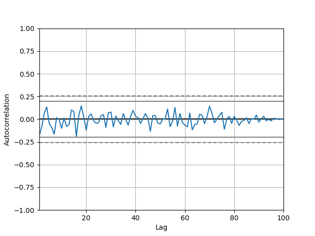

# Table of Contents

1.  [Programming (Python)](#orgf446568)
    1.  [Lists](#orge9fee58)
2.  [Introduction](#org26e9cf0)
    1.  [Systems](#org0eb06e0)
    2.  [Models](#orgcfdaed3)
    3.  [Simulation](#org9ea426b)
    4.  [A Seed](#orga2f24e9)
3.  [Random Numbers Generation](#org9bcffdc)
    1.  [Linear Congruential Method](#org80a0146)
4.  [Testing Randomness](#org2aa086a)
    1.  [Testing Uniformity](#orgacd4657)
    2.  [Testing Independence](#orga70ad81)
5.  [Discrete Random Variable Simulation](#orgd425d83)
    1.  [Bernoulli Distribution](#org873dd6f)
    2.  [Binomial Distribution](#orge2ba46f)
    3.  [Geometric Distribution](#orgd232421)
    4.  [Poisson Distribution](#orgbfbf482)
6.  [Continuous Random Variable Simulation](#orgb25e1f8)
    1.  [Cumulative Distribution Function](#orgbaa80f3)
    2.  [Uniform Distribution](#orgb46828c)
    3.  [Exponential Distribution](#org598da0a)
    4.  [Normal Distribution](#org5c85fd0)
7.  [Choosing the right distribution](#orgb531f04)
8.  [Monte Carlo Method](#orgb734aec)
9.  [Monte Carlo Simulation](#org27a010b)
    1.  [Process](#orgdc3068a)
    2.  [Using Python](#org5e044e4)
    3.  [Inferential Statistics](#orgb537e9a)
10. [Discrete Events Simulation](#orgbf8ac74)
    1.  [Components](#orgc912a13)
    2.  [Types](#orgd3ed713)
    3.  [`simpy` Library](#orgd23b23c)
    4.  [Designing Process](#orga9f8ba2)
    5.  [Example](#org4e81fb7)
11. [Model Building](#org6f2a652)
12. [Regression Models](#orgfa052a0)
13. [Classification Models](#org43a36c0)

<footer style="height: 20vh;"></footer>

# Programming (Python)

-   **Optional Arguments:** This is a great way to make code more flexible. It is used in function definitions like so:
    
        def my_function(a, b, c=1, d=2):
            print(a, b, c, d)
-   **Global Variables:** This is a variable that can be accessed from anywhere in the code. It is defined outside of any function. Here is an example:
    
        x = 1
        def my_function():
            global x
            x = 2
        my_function()
        print(x)

## Lists

-   **Adding normal lists:** If we add normal, lists we get a new list with the elements of both lists
    
        a = [1, 2, 3]
        b = [4, 5, 6]
        c = a + b
        print(c)

-   **Numpy **atomic** vector:** This is a vector, that can only store **one** type of data.
-   **Dataframe Statistics:** We can get statistics from a dataframe using the describe() function
    
        import pandas as pd
        df = pd.DataFrame({'a': [1, 2, 3], 'b': [4, 5, 6]})
        print(df.describe())

# Introduction

## Systems

A system is a group of objects that work together to achieve a goal. It consists of two environments: the inside and the outside. Each entity in the system has attributes or can do activities. A state can be defined for the system or components of the system. Examples of systems include computer systems, forests, restaurants, and banks. The key components of a system are the entities, attributes, activities, states, and events. Systems can be either discrete or continuous, such as the people in a bank or the water levels in a river.

## Models

A model is an abstraction of a real-life situation, where the complexity of the model increases with the number of variables that are taken into account. The simplicity or realism of a model is determined by how closely it reflects the actual situation it is representing.

## Simulation

Simulation is a great tool to use when attempting to gain insights into the behavior of complex systems. Stochastic simulations rely on randomness to predict events, while deterministic simulations are based on predetermined inputs. For example, a restaurant/shop system can be simulated by making assumptions about the number of customers and employees in the system. Simulations are advantageous because they are cheaper, faster, replicable, safer, ethical, and legal when compared to real-life experiments. The decision between using a stochastic or deterministic simulation depends on the circumstances and the desired outputs.

-   The point in which the state of a system changes is called an event.

### Deterministic

In physics, determinism is the idea that all events are predetermined. There is no room for randomness or probability, as all changes are predetermined by the laws of nature. An example of this is an account gaining and losing followers, which is predetermined by the actions of the account holder. To simulate this process in Python, one could create a loop that tracks the number of followers gained and lost over time and stores it in a variable. This variable could then be used to print out the number of followers at any given time.

### Stochastic

Stochastic simulation is a modelling technique which incorporates randomness, making use of random variables to generate a variety of possible outcomes. It is used for analysing complex systems in which the effects of randomness cannot be predicted deterministically, and thus provides a useful tool for predicting and understanding the behaviour of such systems.

### Statics vs Dynamic

Simulations are typically classified as either static or dynamic. In a static simulation, there is no time variable; the system is unchanging and the same set of conditions is used throughout the simulation. In a dynamic simulation, time is a variable, meaning that the system is constantly changing and the conditions of the simulation can evolve over time.

### Decision Tree

I hope this is right.

## A Seed

A seed is any number that can be used to replicate semi-random experiments and simulations. It allows for the same experiment to be repeated in the same way, with the same conditions and results, by using the same seed each time. This makes it easy to compare results from different experiments and simulations, as the same starting point can be replicated.

# Random Numbers Generation

-   getting randomness is almost impossible
-   People confuse randomness with strangeness
-   Continuous distribution to discrete on range 0 to 1 - can be done by rounding
-   Properties of pseudo-random numbers: uniform, independent, unpredictable
-   Testing the randomness of a sequence of numbers:
    -   Look at the distribution of the numbers (visual) - should be uniform
    -   See if there is any pattern
-   Algorithms:
    -   must be fast
    -   must be long
    -   should be repeatable with a seed
-   Setting seed in python `random.seed(2023)`
-   We can generate $n$ random numbers with python by using `np.random.uniform(min,max,nax)`

## Linear Congruential Method

-   We get a random like pattern.
-   It is a linear transformation of a previous number
-   Equation: $x_{n} = (a x_{n-1} + c) \mod m$

    
    import numpy as np
    def LCM(n, seed, a, c, m):
        x = [seed]
        for i in range(1,n+1):
            x.append((a*x[i-1] + c) % m)
        u = np.array(x)/m
        return u
    
    seq =LCM(n=8, seed=4, a=13, c=0, m=64)
    print(seq)

-   Those results are pretty bad

# Testing Randomness

To check if we have an actually random generator, we need to test **uniformity** and **independence**.

## Testing Uniformity

-   We test using hypothesis testing
    -   Null hypothesis = sequence is uniform
    -   Alternative hypothesis = sequence is not uniform
-   We use an alpha level of 0.05. If our $p$ is less than 0.05 we reject the null hypothesis, otherwise we fail to reject the null hypothesis
-   We want to fail to reject the null hypothesis to have uniformity.
-   The test we use is **Kolmogrov-Smirnov** test
-   We use the function `stats.kstest` from the `scipy.stats` library

## Testing Independence

-   We again make use of hypothesis testing
    -   Null hypothesis = sequence is independent
    -   Alternative hypothesis = sequence is not independent
-   To test for the dependence of each number, we use correlation
-   The specific type of correlation we use is **autocorrelation**
    -   This means that we correlate the number and the sequence
-   When we auto-correlate, we need to have a lag
    -   This is the number of steps we take ahead in the sequence
-   We can use a pandas data frame:

    import numpy as np
    import pandas as pd
    import matplotlib.pyplot as plt
    seq = np.random.uniform(0,1,100)
    df = pd.DataFrame(seq, columns=['values'])
    pd.plotting.autocorrelation_plot(df['values'])
    plt.savefig("autocorrelation.png")
    return "autocorrelation.png"

In the above plot:

-   If the line is within the dashed lines, we fail to reject the null hypothesis

We need a more robust way of assessing if the sequence is independent:

    acf, confint = statstools.acf(seq, alpha=0.05, nlags=10)
    lbvalue, pvalue = statstools.q_stat(acf[1:], len(seq))
    print("p-value: ", pvalue)

Now we can use the p-value to test for independence.

A key point here, is the difference between correlation and autocorrelation.

<table border="2" cellspacing="0" cellpadding="6" rules="groups" frame="hsides">

<colgroup>
<col  class="org-left" />

<col  class="org-left" />
</colgroup>
<thead>
<tr>
<th scope="col" class="org-left">Correlation</th>
<th scope="col" class="org-left">Autocorrelation</th>
</tr>
</thead>

<tbody>
<tr>
<td class="org-left">Correlates two variables</td>
<td class="org-left">Correlates a variable with itself</td>
</tr>

<tr>
<td class="org-left">No lag</td>
<td class="org-left">Lag</td>
</tr>
</tbody>
</table>

# Discrete Random Variable Simulation

A random variable is a variable, with some potential outcomes, that is determined by their respective probabilities.

-   **Probability Mass Function:** This is a function that gives the probability of a discrete random variable taking on a specific value.
-   **Cumulative Distribution Function:** This is a function that gives the probability of a discrete random variable taking on a value less than or equal to a specific value.

## Bernoulli Distribution

-   This is a discrete random variable with two possible outcomes
-   The probability of the first outcome is $p$
-   The probability of the second outcome is $1-p$
-   The general pmf is given by $f(x) = p^x(1-p)^{1-x}$
-   Expected value and variance are given by $E(X) = p$ and $Var(X) = p(1-p)$
-   We can simulate this in python using `np.random.binomial(1,p,n)`

## Binomial Distribution

-   Very similar to the Bernoulli distribution
    -   Key difference is that we have $n$ trials
-   The general pmf is given by $f(x) = \binom{n}{x}p^x(1-p)^{n-x}$
-   Expected value and variance are given by $E(X) = np$ and $Var(X) = np(1-p)$
-   We can simulate this in python using `np.random.binomial(n,p,n_1)`
    -   This will give us $n_1$ samples of $n$ trials with probability $p$

## Geometric Distribution

-   This distributions gives us the probability of the first success in $n$ trials
-   The general pmf is given by $f(X = x) = (1-p)^x p$
-   Expected value and variance are given by $E(X) = \frac{1 - p}{p}$ and $Var(X) = \frac{1-p}{p^2}$
-   We can simulate this in python using `np.random.geometric(p,n)`
-   There is also the stats library which gives
    -   `stats.geom.pmf(x,p)` and `stats.geom.cdf(x,p)`

## Poisson Distribution

-   This distribution gives us the probability of $k$ events in a given time period
-   The general pmf is given by $f(x) = \frac{\lambda^x e^{-\lambda}}{x!}$
    -   Turns into an exponential distribution when $\lambda \rightarrow \infty$
    -   $\lambda$ is the mean number of events in the time period
    -   It can take negative values
    -   Values can be non-integer
-   Expected value and variance are given by $E(X) = \lambda$ and $Var(X) = \lambda$
-   We can simulate this in python using `np.random.poisson(lam,n)`
    -   To compute the pdf we can use `stats.poisson.pmf(x,lam)`
-   Approximation
    -

# Continuous Random Variable Simulation

## Cumulative Distribution Function

-   This is a function that gives the probability of a continuous random variable taking on a value less than or equal to a specific value.
-   The general cdf is given by $F(x) = \int_{-\infty}^{x} f(x) dx$

## Uniform Distribution

-   In this distribution, all values are equally likely
-   The pdf is given by $f(x) = \frac{1}{b-a}$
-   Expected value and variance are given by $E(X) = \frac{a+b}{2}$ and $Var(X) = \frac{(b-a)^2}{12}$
-   The cumulative distribution function is given by $F(x) = \frac{x-a}{b-a}$
-   We can simulate this in python using `np.random.uniform(a,b,n)`
    -   We can get the pdf using `stats.uniform.pdf(x,a,b)`

## Exponential Distribution

-   This distribution gives us the probability of the time between events in Poisson processes.
    -   It answers a question such as: "What is the probability that something will happen in the next n minutes?"
-   The pdf is given by $f(x) = \lambda e^{-\lambda x}$ where $\lambda = \frac{1}{E(X)}$
-   Expected value and variance are given by $E(X) = \frac{1}{\lambda}$ and $Var(X) = \frac{1}{\lambda^2}$
-   The cumulative distribution function is given by $F(x) = 1 - e^{-\lambda x}$
-   We can simulate this in python using `np.random.exponential(scale,n)`
    -   The scale is the inverse of the rate parameter $\lambda$
    -   We can get the pdf using `stats.expon.pdf(x,scale)` or

## Normal Distribution

-   This distribution is the most common distribution
-   The pdf is given by $f(x) = \frac{1}{\sqrt{2\pi\sigma^2}} e^{-\frac{(x-\mu)^2}{2\sigma^2}}$ - This is horrible.
-   Expected value and variance are given by $E(X) = \mu$ and $Var(X) = \sigma^2$
-   We can simulate this in python using `np.random.normal(mu,sigma,n)`
    -   We can get the pdf using `stats.norm.pdf(x,mu,sigma)`
    -   We can get the cdf using `stats.norm.cdf(x,mu,sigma)`

# Choosing the right distribution

How do we know which distribution to use? We can use the following table to help us out.

<table border="2" cellspacing="0" cellpadding="6" rules="groups" frame="hsides">

<colgroup>
<col  class="org-left" />

<col  class="org-left" />
</colgroup>
<thead>
<tr>
<th scope="col" class="org-left">Distribution</th>
<th scope="col" class="org-left">Use Case</th>
</tr>
</thead>

<tbody>
<tr>
<td class="org-left">Bernoulli</td>
<td class="org-left">Binary outcome</td>
</tr>

<tr>
<td class="org-left">Binomial</td>
<td class="org-left">Number of successes in \(n\) trials</td>
</tr>

<tr>
<td class="org-left">Geometric</td>
<td class="org-left">Number of trials until first success</td>
</tr>

<tr>
<td class="org-left">Poisson</td>
<td class="org-left">Number of events in a given time period</td>
</tr>

<tr>
<td class="org-left">Uniform</td>
<td class="org-left">All values are equally likely</td>
</tr>

<tr>
<td class="org-left">Exponential</td>
<td class="org-left">Time between events in Poisson processes</td>
</tr>

<tr>
<td class="org-left">Normal</td>
<td class="org-left">Most common distribution</td>
</tr>
</tbody>
</table>

# Monte Carlo Method

First, what is the Monte Carlo method? It is the aggregation of multiple simulations, to infer something.
This should not be confused with the Monte Carlo simulation, which is a simulation of a random variable. Here is a table to help you remember the difference, it highlights the key differences between the two:

<table border="2" cellspacing="0" cellpadding="6" rules="groups" frame="hsides">

<colgroup>
<col  class="org-left" />

<col  class="org-left" />
</colgroup>
<thead>
<tr>
<th scope="col" class="org-left">Monte Carlo Method</th>
<th scope="col" class="org-left">Monte Carlo Simulation</th>
</tr>
</thead>

<tbody>
<tr>
<td class="org-left">A mathematical technique used for solving problems through repeated random sampling</td>
<td class="org-left">A type of Monte Carlo method that involves generating random input values to simulate a system</td>
</tr>

<tr>
<td class="org-left">Used to estimate the value of an unknown quantity based on a sample of random data</td>
<td class="org-left">Used to simulate the behavior of a system under different scenarios</td>
</tr>

<tr>
<td class="org-left">Can be used to solve problems in various fields like finance, engineering, and physics</td>
<td class="org-left">Can be used to analyze the behavior of systems in various fields like finance, engineering, and physics</td>
</tr>

<tr>
<td class="org-left">Can be used to generate random numbers, simulate random walks, and perform numerical integration</td>
<td class="org-left">Can be used to answer the "what if" questions and incorporate a wider variety of scenarios than historical data</td>
</tr>

<tr>
<td class="org-left">Samples are independent and identically distributed</td>
<td class="org-left">Samples can be positively correlated and thereby increases the variance of your estimates</td>
</tr>

<tr>
<td class="org-left">Can be used in combination with Markov chains</td>
<td class="org-left">Can be used to estimate the probability of a particular outcome or the range of possible outcomes</td>
</tr>
</tbody>
</table>

[ref](https://phind.com/search?q=Create+a+table+of+the+key+differences+between+the+monte+carlo+method+and+monte+carlo+simulation)

# Monte Carlo Simulation

Now that we have a basic understanding of the Monte Carlo method, let's talk about the Monte Carlo simulation. This is a simulation of a random variable. We can use this to estimate the expected value of a random variable.

Characteristics:

-   Randomness - has to have a large period between repeats (stochastic)
-   Large sample
-   Valid algorithm
-   Accurately simulates

## Process

1.  Define the domain of inputs (What kind of inputs are we going to use?)
2.  Generate the inputs from a distribution (How are we going to generate the inputs?)
3.  Run a simulation
4.  Replicate
5.  Aggregate

## Using Python

We will often have to select some categorical value when it comes to MCS. In python, we can make use of `numpy.random.choice()` to do this. This function takes in a list of values and a probability distribution and returns a random value from the list. For example, if we wanted to simulate a coin flip, we could do the following:

    import numpy as np
    np.random.choice(['heads', 'tails'], p=[0.5, 0.5])

We do not have to give it the probability distribution, if we do not, it will assume that all values are equally likely. For example, if we wanted to simulate a die roll, we could do the following:

    import numpy as np
    np.random.choice([1, 2, 3, 4, 5, 6])

## Inferential Statistics

-   We use inferential statistics to make inferences about a population from a sample
-   We simulate a sample, calculate the statistics and then use the statistics to make inferences about the population

# Discrete Events Simulation

In this type of simulation, we model real-world systems as a sequence of discrete events. We can use this to model things like a manufacturing process, a supply chain, or a financial market. We can use this to answer questions like "What is the probability that a product will be delivered on time?" or "What is the probability that a customer will buy a product?".

We can also answer questions about how efficient a system is or howmany resources are needed to run a system. For example, we can answer questions like "How many employees are needed to run a manufacturing process?" or "How many machines are needed to run a manufacturing process?".

-   **Warmup Period:** This is a period of time where the simulation is preparing, data is being loaded.

## Components

-   **Entities:** These are the objects that are being modeled. For example, in a manufacturing process, the entities could be products.
-   **Events:** These are the actions that are performed on the entities. For example, in a manufacturing process, the events could be the actions that are performed on the products.
-   **Resources:** These are the things that perform the events. For example, in a manufacturing process, the resources could be the machines that perform the actions on the products.

## Types

-   Activity Oriented
    -   We model the system as a series of activities
-   Event Oriented
    -   We create various events
    -   Benefit: we can keep track of time
-   Process Oriented
    -   Models entire life cycles
    -   Benefit: we can keep track of time and resources

## `simpy` Library

We can create these simulations using `simpy`, a python library for discrete event simulation. We can install it using `pip install simpy`. We can then import it using `import simpy`.

-   The type of simulation is process oriented

The structure of a simulation in `simpy` designed with functional programming is as follows:

1.  Define the environment
2.  Define the resources
3.  Define the processes
4.  Run the simulation

What is a process? A process is a function that defines the behavior of an entity in the simulation. For example, if we were simulating a manufacturing process, we could have a process that defines the behavior of a machine.

We make use of generators to simulate new entities entering the system. We can then use `yield` to wait for a certain amount of time or for a resource to become available. We can then use `env.run()` to run the simulation.

## Designing Process

Let's take a look at a very simple example of a DES to learn how to use generators within discrete eventsimulations. The following graph describes a very simple experiment in which we simulate the queue ofpatients arriving at a weight loss clinic. We will have inter-arrival times of consultations, the entities aspatients, and the activity times will be represented by the consultation time of the patients with the nurse.

This is the process of how to design this simulation:

1.  create a patient generator that generates patients at a certain rate
2.  create an activity generator for each of the patients
    1.  Request a resource (nurse)
    2.  Create a queue time for the patient
    3.  Create a consultation time for the patient
    4.  Release the resource (nurse)
3.  Run the simulation

## Example

Let's say we have a manufacturing process that has 3 machines. We want to know how many products we can make in a day. We can model this using `simpy` as follows:

    import simpy
    import numpy as np
    
    env = simpy.Environment()
    
    # Define the resources
    machine = simpy.Resource(env, capacity=3)
    
    # Define the processes
    def manufacturing_process(env, machine):
        # Wait for a machine to become available
        with machine.request() as request:
            # Wait for the machine to become available
            yield request
            # Wait for the manufacturing process to complete
            yield env.timeout(np.random.uniform(0, 1))
    
    # Run the simulation
    env.process(manufacturing_process(env, machine))
    env.run(until=1)

# Model Building

# Regression Models

# Classification Models

