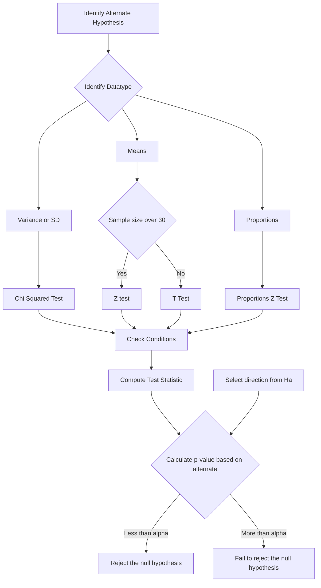

## One Sample Inference

```mermaid
flowchart TD;
    A[Identify Alternate Hypothesis] --> DAT
    DAT{Identify Datatype} --> MEANS[Means]
    DAT --> PROP[Proportions]
    DAT --> VAR[Variance or SD]
    MEANS --> SW1
	SW1{Sample size over 30} -->|Yes| ZT[Z test]
	SW1 --> |No| TT[T Test]
	PROP --> PZT[Proportions Z Test]
	VAR --> CHI[Chi Squared Test]
	CHI --> COND[Check Conditions]
	ZT --> COND
	TT --> COND
	PZT --> COND
	COND --> ACT[Compute Test Statistic]
	ACT --> PV{Calculate p-value based on alternate}
	ADIR[Select direction from Ha] --> PV
	PV --> |Less than alpha|REJ[Reject the null hypothesis]
	PV --> |More than alpha|ACC[Fail to reject the null hypothesis]
```

## Two Sample Inference
