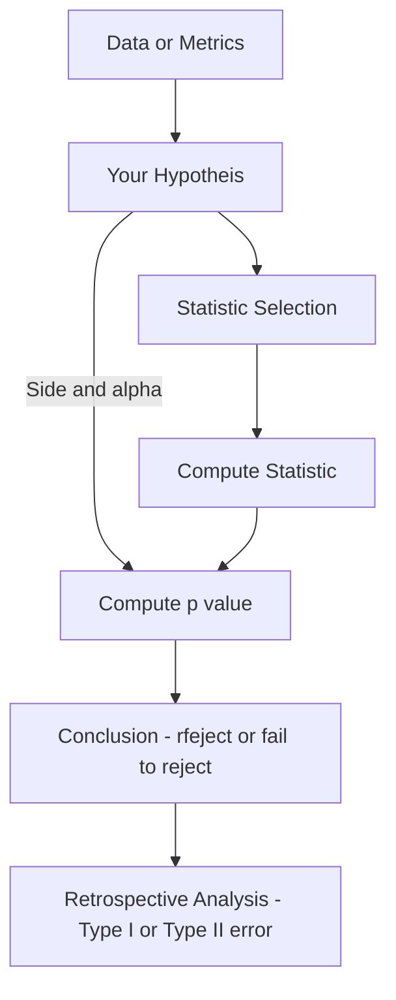

+ [[FDA Final Project]]
+ ![[Probability and Statistics for Engineering and the Sciences (Jay L. Devore) (Z-Library).pdf]]
+ ![[Data Analysis Notes.pdf]]

# Questions to Ask when Solving


# Hypothesis Testing (One Sample)
+ Given by two hypotheses:
	+ Null Hypothesis: The status quo
	+ Alternate Hypothesis: Our assumption (also called a researches hypothesis)
+ Can only have two outcomes
	+ Rejecting $H_0$ or failing to reject $H_0$
	+ To decide which outcome will take place, we use **test procedures**
+ To make a decision on the outcome, we use a p-value
	+ It gives us the **probability of obtaining a certain result assuming that the null hypothesis is true**
 + We also have **general conditions for inference**:
	 + Independence
	 + Normality
	 + Randomness
## Errors
+ We can make two type of mistakes in a hypothesis test:
	+ **Type I**: Rejecting the null hypothesis when it is false
		+ We can make this error if only we reject the null hypothesis
		+ The probability of this error is given by $\alpha$ 
	+ **Type II**: Failing to reject the null hypothesis when it is false
## General Procedure


## Z Test (Means)

Conditions:
+ $n > 30$
+ $\sigma$ is known

Statistic:

$$
Z = \frac{\bar{X} - \mu_0}{\sigma\over\sqrt{n}}
$$

Where $\sigma\over\sqrt{n}$ is the **standard error** and $\mu_0$ is the hypothesized mean.

Once we have the value of $z$ , we can get our **p-value**. We can either get this from a table or using this python code. 

### #TODO Type II Error and $\beta$

### Python
Calculating given a dataset
```python
import statsmodels.stats.weightstats as smw
res = smw.DescrStatsW(x) # where x is our data
z_score, p_value = res.ztest_mean(value=H_0, alternative=direction)
```
Given just metrics:
```python
import numpy as np
import scipy.stats as ss
se = s / np.sqrt(n)
z_score = (x_bar - H_0) / se
p_value = ss.norm.cdf(z_score) # gives area to the left
```

## T Test (Means)

Conditions:
+ $n < 30$
+ $\sigma$ is unknown

Statistic:

$$
t = \frac{\bar{x} - \mu_0}{s \over \sqrt{n}}
$$

We also need the degrees of freedom, which are given by $n - 1$

### Python
Full t-test using formulas:
```python
import scipy.stats as ss
se = s / np.sqrt(n)
t_score = (x_bar - H_0) / se
p_value = ss.t.cdf(t_score, df=n-1)
```
Or for a dataset:
```python
t_score, p_value, d_freedom = res.ttest_mean(value=H_0, alternative=direction)
```

## Z Test (Proportions)

Conditions:
+ We are talking about proportions rather than means or variances
+ $np_0 \geq 10$ and $n(1-p_0) \geq 10$


Statistic:

$$
z = \frac{\hat{p} - p_0}{\sqrt{p_0 (1- p_0) \over n}}
$$

Where $\hat{p}$ is the observed proportion and $p_0$ is the expected. If we fail to reject our $H_0$, the we can say that the distribution of $z$ is approximately normal with:

$$
\begin{align}
E(Z) &= \frac{p^\prime - p_0}{\sqrt{p(q)\over n}} \\
V(z) &= \frac{p^\prime (1-p^\prime)\over n}{p(q)\over n}
\end{align}
$$

Where $q = (1-p)$.
### #TODO beta
### Python
Simple proportions test:
```python
import statsmodels.stats.proportion as smp
p_hat = x / n
smp.proportions_ztest(count=x, nobs=n, value=p_0, alternative=direction, prop_var=p0)
```

##  Z Test (Small Sample Proportions)
Conditions:
+ $n < 30$
We can use a binomial distribution to estimate:

$$
B \sim (x,n,p)
$$

### #TODO beta
### Python
Relatively simple implementation:
```python
import scipy.stats as ss
ss.binom.cdf(x,n,p_0)
```


## Chi Squared (Variances and Standard Deviations)

Conditions:

Statistic:

$$
\chi^2 = \frac{(n-1)s^2}{s_0^2}
$$

We can them compute our p value via tables or python.
### Python
We then go to compute the p-value with either some tables of the following python functions:
```python
import scipy.stats as ss
chi_squared = ((n-1)*s**2)/s_0**2
ss.chi2.cdf(chi_squared, df=n-1)
```

# Hypothesis Testing (Two Sample)
+ Concerns the comparison between two means of samples
	+ We have 2 distributions

## Z Test (Means)

Conditions:
+ Random samples of both distributions
+ Independent of one another
+ Population $\sigma$ must be known

Statistic:

$$
z = \frac{\bar{x} - \bar{y} - \Delta_0}{\sqrt{\frac{\sigma_1^2}{m}-\frac{\sigma_2^2}{n}}}
$$

#TODO Identifying causality

### Type II Error and $\beta$
### Sample Size Selection
+ Provides us with a sample size necessary to satisfy:
	+ Some level of $\alpha$
	+ Some level $\beta$
 
$$
m = n = \frac{(\sigma_1^2 + \sigma_2^2)(z_\alpha + z_\beta)^2}
{(\Delta^\prime - \Delta_0)^2}
$$

That expression is valid if we are conducting a lower or upper tailed test. If we are using a two-tailed, we replace $z_\alpha$ with $z_{\alpha/2}$

### Large Samples
+ Given a larges sample
+ $m > 40$ and $n > 40$

Statistic:

$$
z = \frac{\bar{x} - \bar{y} - \Delta_0}{\sqrt{\frac{s^2}{m}-\frac{s_2^2}{n}}}
$$

We only change the $\sigma$ for $s$.

### Confidence Intervals
+ $n$ and $m$ must be large
+ We get an interval of the difference $\mu_1 - \mu_2$

$$
\bar{x} - \bar{y} \pm z_{\alpha/2}\sqrt{\frac{s_1^2}{m} + \frac{s_2^2}{n}}
$$

Depending on the type of test, we replace $z_{\alpha/2}$ with $z_\alpha$. Sometimes we might also want to compute the size of on interval which would be of width $w$.

$$
n = \frac{4 z_{\alpha/2}^2 (\sigma_1^2 + \sigma_2^2)}{w^2}
$$

Where:

$$
w = z \times se
$$

### Python
Simple test:
```python
a,b = smw.DescrStatsW(a), smw.DescrStatsW(b)
comp = smw.CompareMeans(a,b)
z_score, p_value = comp.ztest_ind(alternative=direction,value=H_0,usevar='unequal')
```

Confidence Interval:
```python
lower, upper = comp.zconfint_diff(alpha, usevar='unequal')
```


## Paired Data
+ We still make two observations (samples)
	+ Both samples come from the same population
+ What we do is run the two samples through a modifier
	+ We start with the two samples
	+ Respectively evaluate the difference between pairs of data
+ With paired data, we work with the differences.

$$
\begin{align}
\mu_D &= E(X - Y) = E(X) - E(Y) = \mu_1 - \mu_2 \\
\sigma^2_D &= V(X - Y) = V(\frac{1}{n}\sum_i{D_i}) = \frac{\sigma_1^2 + \sigma_2^2 - 2\rho\sigma_1\sigma_2}{n}
\end{align}
$$


## T Test (Means)

Conditions:
+ Unknown variance
+ Small Sample size
+ Populations distributions are normal (To check this, just plot the data)

Statistic:

$$
T = \frac{\bar{X} - \bar{Y} - (\mu_1 - \mu_2)}{\sqrt{\frac{S_1^2}{m}+\frac{S_2^2}{n}}}
$$

Degrees of freedom:


### Pooled T Procedures
+ If both samples have
	+ Normal population distributions
	+ Equal variances ($\sigma_1^1 = \sigma_2^2$)

In this case, the statistic is given by:

$$
Z = \frac{\bar{X}-\bar{Y}-(\mu_1 - \mu_2)}{\sqrt{\sigma^2(
\frac{1}{m} + \frac{1}{n}
)}}
$$

For this standardized statistic, the degrees of freedom are given by $(m+n-2)$

### Confidence Interval
#TODO 
### Python
Statistic given dataset:
```python
comp= smw.CompareMeans(a,b) # where a and b are decre stats
tStat, pVal, dfreedom = comp.ttest_ind(usevar='unequal', value=0, alternative='two-sided')
```
Confidence Interval given dataset:
```python
alpha=0.05
lower, upper = comp.tconfint_diff(alpha, usevar='unequal')
```

**IF WE ASSUME EQUAL (pooled)** : We have to replace `unequal` with `pooled`


## Paired Data T Test
+ If we have paired data
	+ The data comes from the same population

Statistic:

$$
t = \frac{\bar{d} - \Delta_0}{s_D \over \sqrt{n}}
$$

The p-value is the computed using either a table or python. From this statistic, we can also create a confidence interval:

$$
\bar{d} \pm t_{\alpha/2,n-1}{s_d\over{\sqrt{n}}}
$$

The **conditions** for this CL are either:
+ $n > 30$
+ Approximately normal distribution of differences
### Python
We first have to get the difference
```python
df['diff'] = df['a']-df['b']
```
Then we can:
```python
comp = smw.DescrStatsW(df['diff'])
tStat, pVal, dfreedom = comp.ttest_mean(value=H_0, alternative='two-sided')
```

For a confidence interval:
```python
alpha=0.05
lower, upper = comp.tconfint_mean(alpha)
```

## Z Test (Proportions)
Conditions: General conditions for inference
+ If we have two samples, and need to infer about some proportion we use:
	+ $\hat{p} = X/n$ where $X\sim Bin(n,p_1)$
	+ $E(\hat{p_1}-\hat{p_2}) = p_1 - p_2$
	+ $Var(\hat{p_1}-\hat{p_2}) = \frac{p_1q_1}{m} + \frac{p_2q_2}{n}$
+ Given a large sample size, we can use the **common p**, also called a weighted estimator:

$$
\hat{p} = \frac{X+Y}{m+n} = \frac{m}{m+n}\hat{p_1} + \frac{n}{n+m}\hat{p_2}
$$

Statistic:

$$
z = \frac{\hat{p_1}-\hat{p_2}}{\sqrt{\hat{p}\hat{q}(\frac{1}{m}+\frac{1}{n})}}
$$

### Type II Error and $\beta$
#TODO 

### Confidence Interval
The CL in this case is given by:

$$
\hat{p_1}-\hat{p_2} \pm z_{\alpha/2}\sqrt{\hat{p}\hat{q}(\frac{1}{m}+\frac{1}{n})}
$$

### Python
Test:
```python
count = np.array([x1, x2])
nobs = np.array([n1,n2])
zStat, pVal = smp.proportions_ztest(count, nobs,value=None, alternative="two-sided",prop_var=False)
```
And now for the confidence interval:
```python
smp.confint_proportions_2indep(x1, n1, x2, n2, method=None, compare='diff', alpha=0.05, correction=True)
```

## F Distribution (Variances)
+ Conceptually connected to Chi Squared
+ Takes 2 parameters $v_1,v_2$
Conditions: General
Statistic:

$$
F = \frac{X_1/v_1}{X_2/v_2}
$$

Where $X_{1,2}$ represent some random variable (in this case $\chi^2$) and $v_{1,2}$ are the respective degrees of freedom. We now define our specific statistic as:

$$
F = \frac{S_1^2/\sigma_1^2}{S_2^2/\sigma_2^2}
$$

The statistic we will use for inference is lowercase $f$ given by:

$$
f = \frac{s_1^2}{s_2^2}
$$

For computing p values, this is a bit different, as the F curve is not normal, here is a table:
| Alternative Hypothesis     | P Value                   |
| -------------------------- | ------------------------- |
| $\sigma_1^2 > \sigma_2^2$  | Area to the right ($A_R$) |
| $\sigma_1^2 < \sigma_2^2$  | Area to the left ($A_L$)  |
| $\sigma_1^2\neq\sigma_2^2$ | $2\times min(A_R,A_L)$    | 

### Confidence Interval

$$
P(F_{1-\alpha/2,v_1,v_2} < F < F_{\alpha/2,v_1,v_2}) = 1 - \alpha
$$
