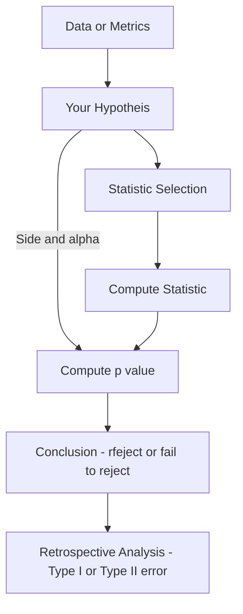
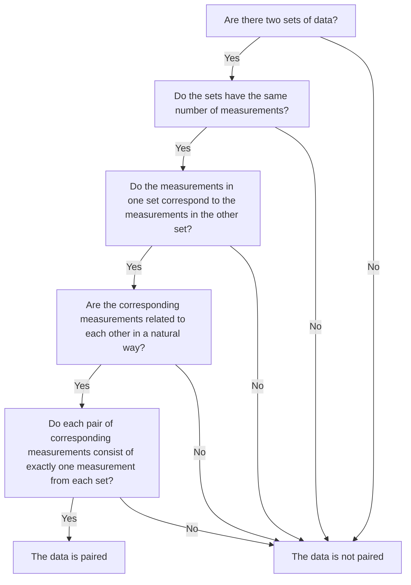

+ Problem Sets
	+ [[FDA Problem Set 4]]
+ [[FDA Final Project]]
+ ![[Probability and Statistics for Engineering and the Sciences (Jay L. Devore) (Z-Library).pdf]]
+ ![[Data Analysis Notes.pdf]]

# Stats Models Parameters First

A modified version of `statsmodels` that allows you to enter parameters directly, rather than just using distributions of data. Start by running the following to import the modified version:

```python
!pip install https://github.com/velocitatem/statsmodels/releases/download/beta2/statsmodelspf-0.1.dev15054+g898b7c7.d20230507-cp310-cp310-linux_x86_64.whl

import statsmodels.stats.weightstats as smw
```

With this modified version you can do more with less code.

# Confidence Intervals
+ A range of values which contains a population parameters with some confidence level
	+ $CL = 100(1-a)\%$
	+ Margin of error: statistical score $\times$ standard error
+ We assume that $\sigma$ is known

General formula for the means:

$$
\bar{x} \pm z_\alpha \frac{\sigma}{\sqrt{n}}
$$

The interpretation is a long-run probability interpretation, if we sample multiple time, we will find that the means falls into the interval CL% of the time. The higher the confidence level, the higher the margin of error.

![[Pasted image 20230511085752.png]]

+ Since the interval has two sides, an area of cl will be achieved by $\alpha/2$
	+ $\bar{x} \pm z_{\alpha/2} \times \frac{\sigma}{\sqrt{n}}$

## Precision and Sample Size
+ We might also have to compute the required sample size for a given CL

$$
n = (2 z_{\alpha/2} \times \frac{\sigma}{w})^2
$$

## Large Sample
+ We do not know $\sigma$
+ Our sample is large enough so that we can assume normality

$$
Z = \frac{\bar{X}-\mu}{\frac{S}{\sqrt{n}}} \quad \ldots \quad \bar{x}\pm z_{\alpha/2}\times\frac{s}{\sqrt{n}}
$$


## Proportions
+ We want to be confident a population proportions will land in some range
+ The formula is a pain

$$
\tilde{p} \pm z_{\alpha/2} \frac{\sqrt{\hat{p}\hat{q}/n + z_{\alpha/2}^2/4n^2}}{1+z_{\alpha/2}^2/n}
$$

Where $\hat{q} = 1 = \hat{p}$. However, with a **large sample** the formula changes to:

$$
\hat{p} \pm z_{\alpha/2}\sqrt{\frac{\hat{p}\hat{q}}{n}}
$$

Because $\tilde{p} \approx \hat{p}$.
### Python
  

```python
import statsmodels.stats.proportion as smp
smp.proportion_confint(count=..., nobs=..., alpha=..., method='normal')
```

where:
- `count` is the number of successes
- `nobs` is the number of observations
- `alpha` is the error level, and
- `method='normal'` implies that we assume the sampling ditribution to follow a normal distribution.
## One Sided
+ We thus far made confidence intervals which went both ways
+ Now we just isolate one direction

$$
\mu \lt \bar{x} + z_{\alpha}\times\frac{s}{\sqrt{n}} \quad\quad\mu \gt\bar{x} -z_{\alpha}\times\frac{s}{\sqrt{n}}
$$

It might seem a bit counter-intuitive, but we try to capture the entirety of the area under the curve, rather than the top.

## Distributions
+ Depending on the sample size and information give:
	+ We select either the $z$ or $t$ distribution
+ The biggest difference comes when getting the $p$ value

$$
s \text{ is unknown}\quad \cdots\quad
\begin{cases}
n > 40 \quad  S\approx\sigma \ldots \text{z distribution} \\
n < 40 \quad \text{t distribution}
\end{cases}
$$


## Variance and Standard Deviation
+ We sample from a normal distribution
	+ We know $\sigma$

$$
\frac{(n-1)S^2}{\sigma^2} = \frac{\sum{(X_i - \bar{X})^2}}{\sigma^2}
$$

This follows the chi squared distribution.

## Python
Simple z interval:
```python
res.zconfint_mean(alpha=0.05, alternative='two-sided/larger/smaller')
```

t interval:
```python
res.tconfint_mean(alpha=0.1, alternative='two-sided/larger/smaller')
```

Variance CI from data:

```python
x=[1470,1510,1690,1740,1900,2000,2030,2100,2190,2200,2290,2380,2390,2480,2500,2580,2700]
n=len(x)
s2=np.var(x,ddof=1)
df=n-1
alpha=0.05

ucl = (n - 1) * s2 / ss.chi2.ppf(alpha / 2, df)
lcl = (n - 1) * s2 / ss.chi2.ppf(1 - alpha / 2, df)
lcl,ucl
```

Variance CL from parameters:
```python
n=292
s2=8.3**2
alpha=0.05
df=n-1

ucl = (n - 1) * s2 / ss.chi2.ppf(alpha / 2, df)
lcl = (n - 1) * s2 / ss.chi2.ppf(1 - alpha / 2, df)
lcl,ucl
```


+ If the null hypothesis is rejected in One Way Anova, we need to perform a post hoc analysis to determine which groups are significantly different from each other
+ Common methods include:
	+ Tukey's HSD (Honestly Significant Difference)
	+ Bonferroni Correction
	+ Scheffe's Method

### Tukey's HSD

$$
q = \frac{\bar{X_i} - \bar{X_j}}{\sqrt{\frac{MSE}{J}}}\geq q_\alpha(J,I,J(I-1))
$$

Where $q_\alpha$ can be found using a table or calculator.

### Bonferroni Correction

$$
\text{New }\alpha = \frac{\alpha}{I(I-1)/2}
$$

Then, we compare the confidence intervals for each pair of groups. If they do not overlap, they are significantly different.

### Scheffe's Method

$$
F = \frac{\text{Max Mean Difference}^2}{MSE/J}
$$

If $F>F_{\alpha,I-1,J(I-1)}$, then the two groups are significantly different.
# Hypothesis Testing (One Sample)
+ Given by two hypotheses:
	+ Null Hypothesis: The status quo
	+ Alternate Hypothesis: Our assumption (also called a researches hypothesis)
+ Can only have two outcomes
	+ Rejecting $H_0$ or failing to reject $H_0$
	+ To decide which outcome will take place, we use **test procedures**
+ To make a decision on the outcome, we use a p-value
	+ It gives us the **probability of obtaining a certain result assuming that the null hypothesis is true**
 + We also have **general conditions for inference**:
	 + Independence
	 + Normality
	 + Randomness
## Errors
+ We can make two type of mistakes in a hypothesis test:
	+ **Type I**: Rejecting the null hypothesis when it is false
		+ We can make this error if only we reject the null hypothesis
		+ The probability of this error is given by $\alpha$ 
	+ **Type II**: Failing to reject the null hypothesis when it is false
## General Procedure


## Z Test (Means)

Conditions:
+ $n > 30$
+ $\sigma$ is known

Statistic:

$$
Z = \frac{\bar{X} - \mu_0}{\sigma\over\sqrt{n}}
$$

Where $\sigma\over\sqrt{n}$ is the **standard error** and $\mu_0$ is the hypothesized mean.

Once we have the value of $z$ , we can get our **p-value**. We can either get this from a table or using this python code. 

### Type II Error and $\beta$
+ $\beta$ gives us the probability of the type II error, whereas the Type II error is given by $\alpha$. 
	+ We can also use this to calculate the required sample size for a specific level of each.
+ The formulas are horrible to compute by hand, so we use python.

Type II Error:
```python
import statsmodels.stats.power as ssp
T2_p = ssp.normal_power_het(mu_prime, n, alpha, std_null=std, std_alternative=None, alternative='larger/smaller/two-sided')
```

Required sample size:
```python
req_n = ssp.zt_ind_solve_power(effect_size=(H_a-H_0)/std, nobs1=None, alpha=0.01, power=0.99, ratio=0, alternative='larger/smaller/two-sided')
```

### Python
Calculating given a dataset
```python
res = smw.DescrStatsW(mean=x_bar, std=std, sample_size=n)
z_score, p_value = res.ztest_mean(value=H_0, alternative=direction)
```
Given just metrics:
```python
res = smw.DescrStatsW(x) # where x is our data
z_score, p_value = res.ztest_mean(value=H_0, alternative=direction)
```

## T Test (Means)

Conditions:
+ $n < 30$
+ $\sigma$ is unknown

Statistic:

$$
t = \frac{\bar{x} - \mu_0}{s \over \sqrt{n}}
$$

We also need the degrees of freedom, which are given by $n - 1$

### Type II Error and $\beta$
Power:

```python
from statsmodels.stats.power import TTestPower
TTestPower().power(effect_size=(H_a-H_0)/std, nobs=n, alternative='larger/smaller/two-sided',alpha=0.01)
```

And the required sample size:

```python
TTestPower().solve_power(effect_size=(H_a-H_0)/std, nobs=None, alpha=0.01, power=0.88, alternative='larger/smaller/two-sided')
```

### Python
Full t-test using formulas:
```python
res = smw.DescrStatsW(mean=x_bar, std=std, sample_size=n)
t_score, p_value, d_freedom = res.ttest_mean(value=H_0, alternative=direction)
```
Or for a dataset:
```python
res = smw.DescrStatsW(data)
t_score, p_value, d_freedom = res.ttest_mean(value=H_0, alternative=direction)
```

## Z Test (Proportions)

Conditions:
+ We are talking about proportions rather than means or variances
+ $np_0 \geq 10$ and $n(1-p_0) \geq 10$


Statistic:

$$
z = \frac{\hat{p} - p_0}{\sqrt{p_0 (1- p_0) \over n}}
$$

Where $\hat{p}$ is the observed proportion and $p_0$ is the expected. If we fail to reject our $H_0$, the we can say that the distribution of $z$ is approximately normal with:

$$
\begin{align}
E(Z) &= \frac{p^\prime - p_0}{\sqrt{p(q)\over n}} \\
V(z) &= \frac{p^\prime (1-p^\prime)\over n}{p(q)\over n}
\end{align}
$$

Where $q = (1-p)$.
### Type II Error and $\beta$
Beta:
```python
beta = ssp.normal_power_het(diff_alt, n, alpha, std_null=std_0, std_alternative=std_a, alternative='smaller/larger/two-sided')
```

Sample size:
```python
req_size = ssp.zt_ind_solve_power(effect_size=diff_alt/std, nobs1=None, alpha=0.01, power=0.99, ratio=0, alternative='smaller/larger/two-sided')
```


### Python
Simple proportions test:
```python
import statsmodels.stats.proportion as smp
p_hat = x / n
smp.proportions_ztest(count=x, nobs=n, value=p_0, alternative=direction, prop_var=p0)
```

##  Z Test (Small Sample Proportions)
Conditions:
+ $n < 30$
We can use a binomial distribution to estimate:

$$
B \sim (x,n,p)
$$

### Type II Error and $\beta$
+ Even for a small sample we can get a type II
	+ In this case, since we generalize with the binomial distribution, its simpler

$$
B(p^\prime) = B(c_a - 1, n, p^\prime)
$$
And in python:

```python
import scipy.stats as ss
beta = ss.binom.cfd(c_a - 1, n , p_prime)
```


### Python
Relatively simple implementation:
```python
import scipy.stats as ss
ss.binom.cdf(x,n,p_0)
```


## Chi Squared (Variances and Standard Deviations)

Conditions:

Statistic:

$$
\chi^2 = \frac{(n-1)s^2}{s_0^2}
$$

We can them compute our p value via tables or python.
### Python
We then go to compute the p-value with either some tables of the following python functions:
```python
import scipy.stats as ss
chi_squared = ((n-1)*s**2)/s_0**2
ss.chi2.cdf(chi_squared, df=n-1)
```

# Hypothesis Testing (Two Sample)
+ Concerns the comparison between two means of samples
	+ We have 2 distributions
+ Exercises: 421

## Z Test (Means)

Conditions:
+ Random samples of both distributions
+ Independent of one another
+ Population $\sigma$ must be known

Statistic:

$$
z = \frac{\bar{x} - \bar{y} - \Delta_0}{\sqrt{\frac{\sigma_1^2}{m}-\frac{\sigma_2^2}{n}}}
$$

#TODO Identifying causality

### Type II Error and $\beta$
### Sample Size Selection
+ Provides us with a sample size necessary to satisfy:
	+ Some level of $\alpha$
	+ Some level $\beta$
 
$$
m = n = \frac{(\sigma_1^2 + \sigma_2^2)(z_\alpha + z_\beta)^2}
{(\Delta^\prime - \Delta_0)^2}
$$

That expression is valid if we are conducting a lower or upper tailed test. If we are using a two-tailed, we replace $z_\alpha$ with $z_{\alpha/2}$

### Large Samples
+ Given a larges sample
+ $m > 40$ and $n > 40$

Statistic:

$$
z = \frac{\bar{x} - \bar{y} - \Delta_0}{\sqrt{\frac{s^2}{m}-\frac{s_2^2}{n}}}
$$

We only change the $\sigma$ for $s$.

### Confidence Intervals
+ $n$ and $m$ must be large
+ We get an interval of the difference $\mu_1 - \mu_2$

$$
\bar{x} - \bar{y} \pm z_{\alpha/2}\sqrt{\frac{s_1^2}{m} + \frac{s_2^2}{n}}
$$

Depending on the type of test, we replace $z_{\alpha/2}$ with $z_\alpha$. Sometimes we might also want to compute the size of on interval which would be of width $w$.

$$
n = \frac{4 z_{\alpha/2}^2 (\sigma_1^2 + \sigma_2^2)}{w^2}
$$

Where:

$$
w = z \times se
$$

### Python
Simple test:
```python
a,b = smw.DescrStatsW(a), smw.DescrStatsW(b)
comp = smw.CompareMeans(a,b)
z_score, p_value = comp.ztest_ind(alternative=direction,value=H_0,usevar='unequal')
```

Confidence Interval:
```python
lower, upper = comp.zconfint_diff(alpha, usevar='unequal')
```

If given summary statistics, just replace each `DescrStatsW(data)` with `DescrStatsW(mean=mean, std=std, var=var, sample_size=n)` 

## Paired Data
+ We still make two observations (samples)
	+ Both samples come from the same population
+ What we do is run the two samples through a modifier
	+ We start with the two samples
	+ Respectively evaluate the difference between pairs of data
+ With paired data, we work with the differences.

$$
\begin{align}
\mu_D &= E(X - Y) = E(X) - E(Y) = \mu_1 - \mu_2 \\
\sigma^2_D &= V(X - Y) = V(\frac{1}{n}\sum_i{D_i}) = \frac{\sigma_1^2 + \sigma_2^2 - 2\rho\sigma_1\sigma_2}{n}
\end{align}
$$

### How to Identify




## T Test (Means)

Conditions:
+ Unknown variance
+ Small Sample size
+ Populations distributions are normal (To check this, just plot the data)

Statistic:

$$
T = \frac{\bar{X} - \bar{Y} - (\mu_1 - \mu_2)}{\sqrt{\frac{S_1^2}{m}+\frac{S_2^2}{n}}}
$$

Degrees of freedom:


### Pooled T Procedures
+ If both samples have
	+ Normal population distributions
	+ Equal variances ($\sigma_1^1 = \sigma_2^2$)

In this case, the statistic is given by:

$$
Z = \frac{\bar{X}-\bar{Y}-(\mu_1 - \mu_2)}{\sqrt{\sigma^2(
\frac{1}{m} + \frac{1}{n}
)}}
$$

For this standardized statistic, the degrees of freedom are given by $(m+n-2)$

### Confidence Interval
#TODO 
### Python
Statistic:
```python
comp= smw.CompareMeans(a,b) # a,b can either be DescrStatsW from a dataset or parameters
tStat, pVal, dfreedom = comp.ttest_ind(usevar='unequal', value=0, alternative='two-sided')
```
Confidence Interval:
```python
alpha=0.05
comp.summary(use_t=False, alpha=0.1, usevar='unequal')
```

**IF WE ASSUME EQUAL (pooled)** : We have to replace `unequal` with `pooled`


## Paired Data T Test
+ If we have paired data
	+ The data comes from the same population

Statistic:

$$
t = \frac{\bar{d} - \Delta_0}{s_D \over \sqrt{n}}
$$

The p-value is the computed using either a table or python. From this statistic, we can also create a confidence interval:

$$
\bar{d} \pm t_{\alpha/2,n-1}{s_d\over{\sqrt{n}}}
$$

The **conditions** for this CL are either:
+ $n > 30$
+ Approximately normal distribution of differences
### Python
We first have to get the difference
```python
df['diff'] = df['a']-df['b']
```
Then we can:
```python
comp = smw.DescrStatsW(df['diff']) # here you can again replace with parameters
tStat, pVal, dfreedom = comp.ttest_mean(value=H_0, alternative='two-sided')
```

For a confidence interval:
```python
alpha=0.05
lower, upper = comp.tconfint_mean(alpha)
```

## Z Test (Proportions)
Conditions: General conditions for inference
+ If we have two samples, and need to infer about some proportion we use:
	+ $\hat{p} = X/n$ where $X\sim Bin(n,p_1)$
	+ $E(\hat{p_1}-\hat{p_2}) = p_1 - p_2$
	+ $Var(\hat{p_1}-\hat{p_2}) = \frac{p_1q_1}{m} + \frac{p_2q_2}{n}$
+ Given a large sample size, we can use the **common p**, also called a weighted estimator:

$$
\hat{p} = \frac{X+Y}{m+n} = \frac{m}{m+n}\hat{p_1} + \frac{n}{n+m}\hat{p_2}
$$

Statistic:

$$
z = \frac{\hat{p_1}-\hat{p_2}}{\sqrt{\hat{p}\hat{q}(\frac{1}{m}+\frac{1}{n})}}
$$

### Type II Error and $\beta$


### Confidence Interval
The CL in this case is given by:

$$
\hat{p_1}-\hat{p_2} \pm z_{\alpha/2}\sqrt{\hat{p}\hat{q}(\frac{1}{m}+\frac{1}{n})}
$$

### Python
Test:
```python
import statsmodels.stats.proportion as smp
count = np.array([x1, x2])
nobs = np.array([n1,n2])
zStat, pVal = smp.proportions_ztest(count, nobs,value=None, alternative="two-sided",prop_var=False)
```
And now for the confidence interval:
```python
smp.confint_proportions_2indep(x1, n1, x2, n2, method=None, compare='diff', alpha=0.05, correction=True)
```

## F Distribution (Variances)
+ Conceptually connected to Chi Squared
+ Takes 2 parameters $v_1,v_2$
Conditions: General
Statistic:

$$
F = \frac{X_1/v_1}{X_2/v_2}
$$

Where $X_{1,2}$ represent some random variable (in this case $\chi^2$) and $v_{1,2}$ are the respective degrees of freedom. We now define our specific statistic as:

$$
F = \frac{S_1^2/\sigma_1^2}{S_2^2/\sigma_2^2}
$$

The statistic we will use for inference is lowercase $f$ given by:

$$
f = \frac{s_1^2}{s_2^2}
$$

For computing p values, this is a bit different, as the F curve is not normal, here is a table:
| Alternative Hypothesis     | P Value                   |
| -------------------------- | ------------------------- |
| $\sigma_1^2 > \sigma_2^2$  | Area to the right ($A_R$) |
| $\sigma_1^2 < \sigma_2^2$  | Area to the left ($A_L$)  |
| $\sigma_1^2\neq\sigma_2^2$ | $2\times min(A_R,A_L)$    | 


### Confidence Interval

$$
P(F_{1-\alpha/2,v_1,v_2} < F < F_{\alpha/2,v_1,v_2}) = 1 - \alpha
$$

### Python

```python
f = sx2/sy2
import scipy.stats as ss
critical=ss.f.ppf(1-alpha,dfx,dfy)
f<critical
```

# Analysis of Variance (Anova)
+ Compares some number of groups
+ We distinguish between **one way** and **two way**
	+ It refers to the number of factors in the response variable
+ For each independent variable (**treatment**)
	+ We have a **group** or **level** - this is just various types of the independent variable

## One Way Anova
+ We compare **two** groups (their means)
	+ The null hypothesis is that they are the same

Statistic:

$$
\begin{align}
F &= \frac{MSTr}{MSE} \\
MSTr &= \frac{J}{I - 1}\sum_i{(\bar{X_i} - \bar{X})^2} = \frac{SSTr}{I-1} \\
MSE &= \frac{S_i^2 + S_2^2 + \cdots + S_i^2}{I} = \frac{SSE}{I(J-1)}
\end{align}
$$

Where $I = \text{treatments}$ and $J = \text{groups in each treatment}$. Once we have the F statistic, we can use functions to get the probability or we can get a rejection region.

## Post Hoc Analysis


